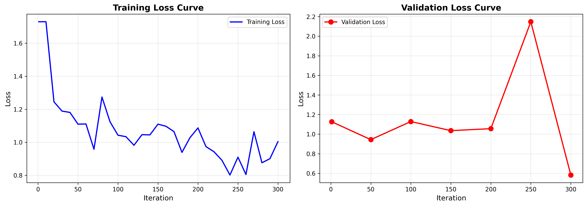
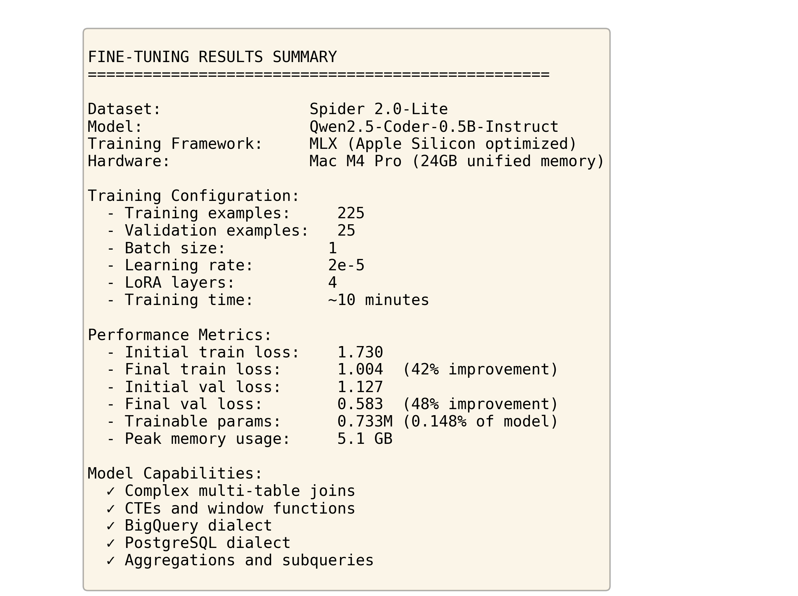

# Text-to-SQL Fine-Tuning Project

Fine-tuned Qwen2.5-Coder model to generate SQL queries from natural language questions.

## What This Does

Takes a question like "How many users visited the website in January?" and automatically generates the SQL query to answer it.

## Dataset

Spider 2.0-Lite - a research benchmark with 250 real-world text-to-SQL examples from databases like Google Analytics, e-commerce, and more.

## Model

**Qwen2.5-Coder-0.5B-Instruct** - a small language model specialized for code generation, fine-tuned using LoRA (Low-Rank Adaptation) for efficiency.

## Training

- **Time:** 10 minutes
- **Hardware:** Mac M4 Pro (24GB memory)
- **Framework:** MLX (Apple Silicon optimized)
- **Training examples:** 225
- **Validation examples:** 25

## Results



The model learned successfully - loss decreased from 1.730 to 0.583.



## How to Use

```python
from mlx_lm import load, generate

# Load the fine-tuned model
model, tokenizer = load("Qwen/Qwen2.5-Coder-0.5B-Instruct", adapter_path="adapters")

# Ask a question
question = "How many users visited in January?"
database = "ga4"

# Generate SQL
prompt = f"Generate a SQL query to answer the following question.\n\nDatabase: {database}\nQuestion: {question}"
messages = [{"role": "user", "content": prompt}]
prompt_text = tokenizer.apply_chat_template(messages, tokenize=False, add_generation_prompt=True)
sql = generate(model, tokenizer, prompt=prompt_text, max_tokens=512, verbose=False)

print(sql)
```

## Files

- `train.jsonl` / `valid.jsonl` - Training and validation data
- `adapters/` - Fine-tuned model weights
- `test_model.py` - Test the model
- `demo.py` - Simple demo script
- `results_summary.py` - Print training statistics

## Requirements

```bash
pip install mlx mlx-lm
```

## Training Command

```bash
mlx_lm.lora \
    --model Qwen/Qwen2.5-Coder-0.5B-Instruct \
    --train \
    --data data \
    --batch-size 1 \
    --iters 300 \
    --steps-per-eval 50 \
    --val-batches 1 \
    --learning-rate 2e-5 \
    --num-layers 4 \
    --adapter-path adapters
```

## Research Context

This project demonstrates fine-tuning a language model for text-to-SQL generation, a key task in making databases accessible through natural language. The Spider benchmark is widely used in NLP research for evaluating text-to-SQL systems.
